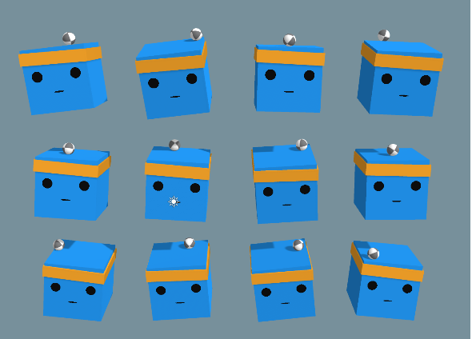

# ML Project — 3D Balance Ball (Unity + ML-Agents)

Un proiect de machine learning / reinforcement learning care folosește Unity și ML-Agents pentru a controla și menține echilibrul unei bile pe o platformă 3D.



---

## Descriere

Acest proiect implementează scenariul “Balance Ball” în 3D, folosind ML-Agents. Rolul agentului (bila) este de a învăța să rămână echilibrată pe o platformă înclinabilă, folosind forțe controlate.

### Caracteristici principale

- Interacțiunea cu Unity ML-Agents  
- Politică de control bazată pe comportament învățat  
- Scenarii de antrenare și evaluare  
- Structură modulară (folderul `Project`, `config`, etc.)  

### Structură fișiere

- `Project/` — cod și scene Unity  
- `config/` — fișiere de configurare pentru antrenare  
- `results/` — rezultatele obținute în timpul antrenării  
- `Image.png` — imagine reprezentativă (capture de ecran)  
- `README.md` — fișierul acesta  

---

## Cum rulezi

1. Clonează repository-ul  
   ```bash
   git clone https://github.com/Filip-Felix/ml_project.git

2.Deschide proiectul în Unity

3. Configurează setările ML-Agents (versiune, comportament, parametri)

4. Antrenează agentul (folosind comanda / scenariul corespunzător)

5. Observă rezultatele (în folderul results)
